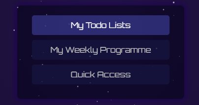

# PlanWise Application README

## Table of Contents
- [Application Overview](#application-overview)
- [Usage Scenarios](#usage-scenarios)
- [Page Flow Diagram](#page-flow-diagram)
- [Project Members and Responsibilities](#project-members-and-responsibilities)
- [Libraries Used](#libraries-used)
- [Running the Project](#running-the-project)

## Application Overview

**PlanWise** is a comprehensive planning tool designed to streamline the organization of daily tasks, weekly schedules, and quick access to frequently used links. Targeted towards students, PlanWise offers a centralized platform for task management, schedule planning, and resource accessibility, ensuring users stay organized and efficient.

### Purpose

The primary purpose of PlanWise is to:
- Facilitate daily task management through customizable to-do lists.
- Allow users to plan and visualize their weekly academic and professional engagements.
- Provide quick access to a curated list of useful links and resources and also quick e-mail shortcut.

### Functions

PlanWise offers several key functionalities:
- Creation and management of to-do lists, with options to add, complete, and remove tasks.
- A weekly program planner for scheduling academic lectures and professional meetings.
- A shortcuts page for quick access to frequently used websites and resources and a e-mail shortcut.

## Usage Scenarios

### Scenario 1: Welcome Page
1. Open the PlanWise application.
2. Enter your details.
3. Select your department
4. Click the "Submit" button to access your personalized PlanWise dashboard.
 

### Scenario 2: Adding a New Task to the Todo lists

1. Navigate to the "My Todo Lists" page from the home screen.
2. To add a task: Click into the field that matches the type of task you want to add (for example, the Academical field). Type your task and press 'Enter'. Your task will appear in the list below the field.
3. As you complete tasks throughout your day, click on each completed task in its list. This will mark the task as completed, visually striking it through.
4. At the and of the day if you want to clear the completed task, click the "Clear List" button located at the bottom of each task list section. This will remove all tasks that you've marked as completed.

### Scenario 3: Scheduling and Managing Weekly Events

PlanWise offers a dynamic and interactive weekly program planner designed to help you efficiently schedule and manage your weekly events, be they academic lectures, professional meetings, or personal commitments. Here’s how you can use it:

1. From the home page, navigate to the "My Weekly Programme" section.
2. You will see a grid representing the days of the week (from Monday to Sunday) and time slots for each day.
3. **To schedule a new event**: 
   - Click on the desired time slot corresponding to the day and time you wish to schedule your event.
   - A cursor will appear in the selected time slot. Enter the details of your event (e.g., "Team Meeting" or "Math Lecture") and press 'Enter'. Your event is now scheduled and visible in the weekly program.
4. **To modify or review an event**: Simply click on the event you've entered. You can now edit the text directly in the time slot to update the event details. Press 'Enter' to save any changes.
5. **To remove an event**: Double-click on an existing event in your schedule. This action will clear the event from the time slot, allowing you to keep your weekly program accurate and up-to-date.

This interactive scheduling tool is designed to make it easy for you to visualize your week at a glance, plan efficiently, and adapt your schedule as your plans evolve.

### Scenario 4: Quick Access Page

1. From the home page, click on "Quick Access" to navigate to the shortcuts page.
2. This page displays a collection of frequently used links and resources such as GitHub, StackOverflow, LinkedIn, YouTube, and more.
3. Click on any link to open it in a new tab for quick and easy access.
4. For sending a quick email, scroll to the "Send Email" section. Enter the recipient's email, your message, and click "Send Email" to utilize the quick email feature.

## Page Flow Diagram

## Project Members and Responsibilities

- **Emre Kolbakir**: Responsible for the entire project, including front-end design, back-end functionality, and documentation.

## Libraries Used

- **Orbitron Font (Google Fonts)**: Used for the application's typography to enhance UI aesthetics.
- **Local Storage API**: Utilized for storing and retrieving user data (e.g., tasks, events) directly in the browser without needing a backend.

## Running the Project

To run PlanWise locally:

1. Clone the repository to your local machine.
git clone https://github.com/EmreKolbakir/CS391-P1-EmreKolbakir
2. Ensure you have [Visual Studio Code] installed on your machine.
3. Open Visual Studio Code and install the [Live Server extension]. This can be done by searching for "Live Server" in the Extensions view (Ctrl+Shift+X or Cmd+Shift+X on macOS).
4. Open the cloned project folder in Visual Studio Code.
5. Find the index.html file in the project structure, right-click on it, and select "Open with Live Server". This action will launch your default web browser and serve your project on a local server, typically at http://127.0.0.1:5500/index.html.
6. Explore the application's features by navigating through the pages using the links provided within the application.

*Note: The only additional setup required is Visual Studio Code and the Live Server extension. No further dependencies are necessary for running this project.*

